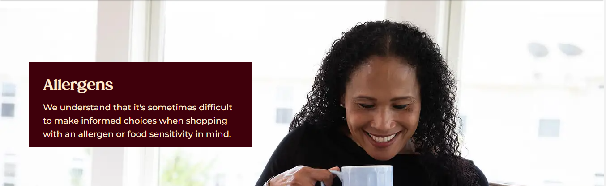
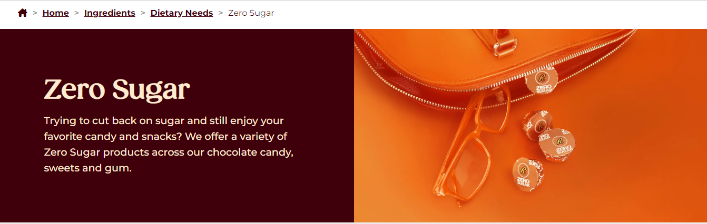
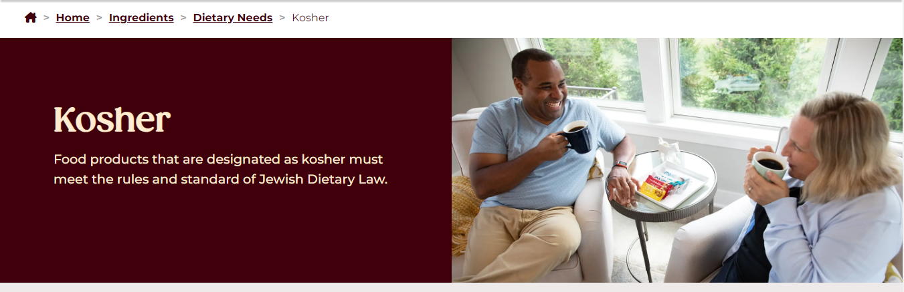

# thehersheycompany.com :chocolate_bar:

## HOSTED LINK OF OUR PROJECT
To explore the project, visit the [https://sudhanshusudan33.github.io/Hershey-UI/index.html](https://sudhanshusudan33.github.io/Hershey-UI/index.html)

# Languages Used 
HTML CSS

# Project Description
The Complete UI of Hershey(Allergens and Dietary Needs) using HTML, CSS, All the properties of CSS and Media Queries for Responsiveness

# Allergens 

# Dietary Needs

# Zero Sugar

# Kosher

# Gluten Free

